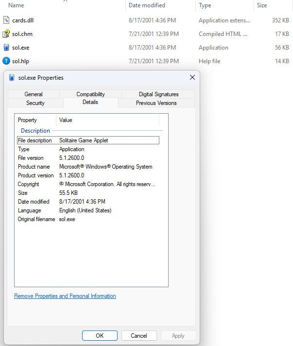

# solitaire-bot4

A perfect-information solver for Windows XP Solitaire (Klondike). Reads ALL cards from process memory — including face-down tableau cards and the stock pile order — solves the game completely before making any moves, then executes the winning sequence.

## How It Works

1. **Read everything** — Reads all 52 cards from `sol.exe` process memory, including face-down cards. The bot knows every card in every pile before making a single move.
2. **Solve perfectly** — Runs a depth-first search with pruning to find a complete winning move sequence. Since all cards are known, Klondike becomes a deterministic puzzle.
3. **Play the solution** — Executes the pre-computed move sequence using mouse/keyboard inputs.
4. **Redeal if unsolvable** — If no solution exists (or the solver times out), automatically redeals and tries the next game.

No OCR, no image recognition, no guessing. Pure memory reading + perfect solving.

## How It Differs from Bot3

| | Bot3 | Bot4 |
|---|---|---|
| **Card knowledge** | Only sees face-up cards | Sees ALL cards (face-up and face-down) |
| **Strategy** | Heuristic (priority-based, one move at a time) | Perfect solver (complete solution before playing) |
| **Move selection** | Best guess based on visible state | Pre-computed optimal sequence |
| **Unsolvable games** | Gets stuck, redeals after exhausting stock | Detects unsolvable immediately, redeals instantly |
| **Expected win rate** | ~20-30% | ~80% (limited only by mathematically unsolvable deals) |

## Expected Win Rate

Approximately **79-82%** of Klondike (draw-1) deals are solvable. Bot4 should achieve near that theoretical maximum — the only losses are deals that are genuinely impossible to win, plus any that exceed the solve timeout.

## Target Solitaire Version



This bot was written for the Windows XP version of Solitaire (`sol.exe`). The image above shows the files and version this bot targets.

```
-rwxr--r--. 1 vorty vorty 359936 Aug 17 2001 cards.dll
-rwxr--r--. 1 vorty vorty  16962 Jul 21 2001 sol.chm
-rwxr--r--. 1 vorty vorty  56832 Aug 17 2001 sol.exe
-rwxr--r--. 1 vorty vorty  13517 Jul 21 2001 sol.hlp
```

**sol.exe checksums:**
- MD5: `373e7a863a1a345c60edb9e20ec32311`
- SHA-256: `a6fc95a5b288593c9559bd177ec43bf9b30d8a98cf19e82bf5a1ba5600857f04`

## Requirements

- **Windows 7/10/11** (runs on any Windows that can run XP Solitaire)
- **Python 3.8+**
- **Windows XP Solitaire** (`sol.exe` + `cards.dll`) installed at `C:\Games\SOL_ENGLISH\`
- Python packages: `pywin32`, `keyboard`

## Installation

```bash
pip install -r requirements.txt
```

## Usage

```bash
python main.py
```

The bot will:
1. Launch Solitaire (or connect to a running instance)
2. Read all cards from memory
3. Solve the game (you'll see "Solving..." in the console)
4. If solvable: execute all moves and win
5. If unsolvable: redeal and try the next game
6. Repeat until you press Escape

Press **Escape** at any time to stop (works globally).

## Options

| Flag | Description | Default |
|---|---|---|
| `--fast` | Run as fast as possible (minimal delays) | Off |
| `--speed SECS` | Delay between moves in seconds | `0.2` |
| `--solve-timeout SECS` | Max time to spend solving each game | `30` |
| `--max-stock-passes N` | Max stock passes the solver considers | `5` |
| `--max-attempts N` | Max games to attempt (0 = unlimited) | `0` |
| `--verbose` / `-v` | Show detailed output (hidden cards, move log) | Off |
| `--no-launch` | Don't auto-launch sol.exe | Off |
| `--exe PATH` | Custom path to sol.exe | `C:\Games\SOL_ENGLISH\sol.exe` |

### Examples

```bash
# Fast mode with verbose output
python main.py --fast --verbose

# Longer solve timeout for harder games
python main.py --solve-timeout 60

# Play exactly 10 games and stop
python main.py --max-attempts 10

# Quick benchmark: fast mode, 50 games
python main.py --fast --max-attempts 50
```

## Solver Design

The perfect solver uses depth-first search with aggressive pruning:

### Move Ordering (tried first → last)
1. **Foundation moves** — Move cards to foundations (especially if it exposes a hidden card)
2. **Tableau moves exposing hidden cards** — Highest non-foundation priority
3. **Tableau moves emptying columns** — Free space for Kings
4. **Other tableau moves** — Sequence building
5. **Waste to tableau** — Use drawn cards
6. **Draw from stock** — Last resort
7. **Recycle waste** — Only when stock is empty

### Pruning
- **Forced moves** — Aces and safe Twos are auto-moved to foundations (no branching)
- **Transposition table** — Skip states we've already explored
- **Stock pass limit** — Don't cycle the stock endlessly (default: 5 passes)
- **Timeout** — Give up after N seconds (default: 30s)
- **King-to-empty filtering** — Only move Kings to empty columns if it exposes a hidden card

### Auto-Deal Behavior
- **Game won**: Wait 5 seconds for animation, send F2, wait 1 second, send Space to accept "Deal Again?"
- **Game unsolvable**: Send F2 to redeal immediately

## Memory Layout (Reverse Engineered)

| Address/Offset | Description |
|---|---|
| `0x01007170` | Pointer to main game object |
| `game + 0x64` | Pile count (13 for Klondike) |
| `game + 0x6c` | Array of 13 pile pointers |
| `pile + 0x1c` | Card count in pile |
| `pile + 0x24` | Card array (12 bytes per card) |

### Card Encoding (WORD at card + 0x00)

- **Bits 0–5**: Card ID (0–51)
  - `card_id % 4` → Suit: 0=Clubs, 1=Diamonds, 2=Hearts, 3=Spades
  - `card_id / 4` → Rank: 0=Ace, 1=Two, … 12=King
- **Bit 15 (0x8000)**: Face-up flag (set = face up, clear = face down)

### Pile Layout

| Index | Pile |
|---|---|
| 0 | Stock (draw pile) |
| 1 | Waste (drawn cards) |
| 2–5 | Foundations (♣ ♦ ♥ ♠) |
| 6–12 | Tableau columns (left to right) |

## Architecture

```
main.py              — Entry point, CLI, solve-then-play game loop
perfect_solver.py    — Perfect-information DFS solver
solver.py            — Move types and data structures
game_state.py        — Game state model with clone/apply_move/hash
memory_reader.py     — Process attachment and memory reading
input_controller.py  — Mouse/keyboard input to sol.exe window
```

## License

MIT
